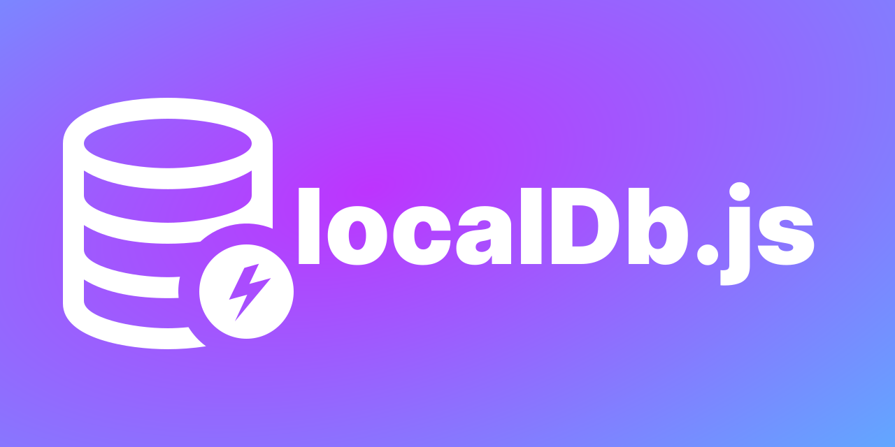

# **localDb.js 1.3.3**


localDb.js is a simple `Javascript` `Library` with which you can perform some operations like a database do. It is not actually a database, but performs same as a database do. It stores data on browser's `localStorage`. **It gives some functionality like `UPDATE`, `DELETE`, `INSERT`, `SORT`, `QUERY` etc** which we used to do in `SQL` like databases.
# By Abinash Karmakar
- Abinash Karmakar
- License : MIT ( [Read License](LICENSE))
>I made this library as easy to use as possible.



## npm
```
> npm i localstorage-db.js
```

## HOW IT WORKS :
>You should have a basic knowledge of `Javascript` `objects`.

It saves everything in `JSON` format in browser's `localStorage`. You can imagine a table or a container to get the concept of how it works. Go through the page to clear the concept.


# How to Use 
At first you have to add a source of localDb.js in your web page before you use any javascript code of this library.
```html
<script src="https://codeAbinash.github.io/localDb.js/localDb.min.js" type="module"></script>
```
```html
<script src="https://codeAbinash.github.io/localDb.js/localDb.js" type="module"></script>
```

## OR
```js
import localDb from "https://codeAbinash.github.io/localDb.js/localDb.min.js"
```
```js
import localDb from "https://codeAbinash.github.io/localDb.js/localDb.js"
```
## Create A Database | `localDb()`
```javascript
var StdS = new localDb("Students");
```
In this example it creates a database named `"Students"`, and this database will be accessed by the `StdS` variable. If the database stored any data previously by this name( `"Students"` ) in `localStorage`, the previous data will still be available.
```javascript
var StdS = new localDb("Students","new");
```
Creates a new database, Previous data will be deleted.
- ## insert values in a database | `insVal()`
```javascript
StdS.insVal( // insert data as multiple objects
    {name:"Abinash",age:19,roll:10},
    {name:"Ram",age:20,roll:11},
    {name:"Sujan",age:21,roll:12},
    {name:"Pithu",age:22,roll:13}
);    
```
```javascript
StdS.insVal( // insert data as multiple objects
    {"name":"Abinash","age":19,"roll no":10},
    {"name":"Ram","age":20,"roll no":11},
    {"name":"Sujan","age":21,"roll no":12},
    {"name":"Pithu","age":22,"roll no":13}
); // if you want to use multi word keys, you have to quote them (Concept of js objects)
```
Inserts all data as `javascript` `objects` in `Students` database.
```js
var data = [
    {name:"Abinash",age:19,roll:10},
    {name:"Ram",age:20,roll:11},
    {name:"Sujan",age:21,roll:12},
    {name:"Pithu",age:22,roll:13}
];
StdS.insVal(data);
 // insert data as array of objects
```
Insert as `array` of `objects`. Here `data` is a `array` of `objects`.
## Query Results | `get()`

- ### All Results
```js
var allData = StdS.get();
// All data will be stored in the allData variable
console.log(allData);
```


- ### By Index number
```js
var std = StdS.get(5);
// Returns the 5 indexed element.
```


- ### By number
```js
var x = StdS.get(5,"first");
// Returns first 5 elements
```
```js
var x = StdS.get(10,"last");
// Returns last 10 elements
```


- ### Condition based results
```js
var sujan20 = StdS.get("name=='Sujan' && age>20"); 
// Get from all elements where condition is true
```
```js
var x = StdS.get(5,"name=='Abinash'"); 
// Get total 5 elements from first where condition is true
```
```js
var x = StdS.get(5,"name=='Abinash'","last"); 
// Get total 5 elements from last where condition is true
var x = StdS.get(7,"name=='Abinash'","first"); 
// Get total 7 elements from first where condition is true
var x = StdS.get(5,"last","name=='Abinash'"); 
// Get total 5 elements from last where condition is true
var x = StdS.get(7,"first","name=='Abinash'"); 
// Get total 7 elements from first where condition is true
```
> Results are always stored as array of objects


## Update Data | `set()`
- ### Update by index number
```js
StdS.set("name='Ks'",2); 
// Set name='Ks' of the second element and returns 1
```
- ### Update by Condition
```js
//dbName.set(apply,condition)
StdS.set("name='K'","name=='Abinash' && age>20"); 
//Changes in all elements by condition and returns number of updated elements
```
```js
StdS.set("name='S'","roll==25",10); 
// checks first 10 elements, and updates where condition is true
```
```js
StdS.set("age=25","name=='Abinash'","last",10); 
// checks last 10 elements and updates where conditions is true
StdS.set("age=25","name=='Abinash'","first",20); 
// checks first 20 elements and updates where conditions is true
StdS.set("age=25","name=='Abinash'",20,"first"); 
// checks first 20 elements and updates where conditions is true
StdS.set("age=25","name=='Abinash'",10,"last"); 
// checks last 10 elements and updates where conditions is true
```
> `set()` always returns how many elements are updated

## Delete data | `del()` | `delAll()` | `delDb()`
- ### Delete all data
```js
StdS.delAll(); //Deletes all data in the database
```
- ### Delete by index Number
```js
StdS.del(5); //Deletes the 5 indexed (6th) element
```
- ### Delete by Number
```js
StdS.del(2,"first");
//Deletes first 2 elements without any condition
StdS.del(3,"last");
//Deletes last 3 elements without any condition
```
- ### Delete by Condition
```js
StdS.del("name=='Ram' && age>=25");
// Delete where name is 'Ram' and age>=25 from all data
```
```js
StdS.del(3,"last","name=='Abinash'");
StdS.del(3,"name=='Abinash'","last");
// delete where name is 'Abinash, from last 3 elements

StdS.del(3,"first","name=='Abinash'");
StdS.del(3,"name=='Abinash'","first");
// delete where name is 'Abinash, from first 3 elements
```
- ### Delete Database
```js
StdS.delDb(); // Deletes the database and it's all data
```
> Delete functions always returns how many data are deleted
## Sort Database | `sort()`
> `sort()` returns the localDb object after sorting
- ### Sort by a specific property
```js
StdS.sort("age");
//sort() returns the localDb object after sorting
//Sorts all data in ascending order
```
- ### Ascending and Descending
```js
StdS.sort("name");
//    OR
StdS.sort("name","aSC");// the second argument is case insensitive
//    OR
StdS.sort("name","ascending");
// Get the same result, Sorts ascending

StdS.sort("name","deS");
StdS.sort("name","dEscenDing");
// Sorts Descending
```
- ### Get the max and min property value
```js
var y = StdS.sort("age").get(0);
//Get the 1st element after sorting
//Means the element with smallest age value
//Or this can also be done
StdS.sort("age");
var y = StdS.get(0);
//Get Same Result

var y = StdS.sort("age","des").get(0);
//Get the 1st element after sorting
//Means the element with maximum age value
```
- ### Save after sorting
If you `save()` after sorting, the sorted Database will be saved in localStorage
```js
StdS.sort("name").save();
//         OR
StdS.sort("name");
StdS.save(); // Save all sorted data
```

- ### Multiple Sorting
You can "Sort after a Sorting" in a single line.
```js
var y = StdS.sort("age","des").sort("name","asc");
// First sorts by age and then by name
```


# Advanced 
- ### Get name of Database | `getName()`
```js
var x = StdS.getName(); // Returns the name of the database
console.log(x);
```
- ### Get the key name | `getKeyName()`
It will return a string, all data is saved by this string(Name) in the localStorage.
```js
var x = StdS.getKeyName();
console.log(x); // "lDark#4s5dStudentskey2sd55"
```
- ### Set Name of Database | `setName()`
```js
var d = StdS.setName("D");
// Changes the name of the database and returns the changed database
console.log(d.get());
```
```js
// This can also be done
StdS.setName("D");
// All data will be copied to "D" and the StdS database will be deleted
var d = new localDb("D");
console.log(d.get());
```
- ### Get Number of Elements | `length()`
```js
console.log(d.length());
// Returns the number of elements in the Database
```
- ### Copy DB to Another DB | `copy()`
```js
var s = new localDb("myDb");
s.copy(a);
// now s has the all values of a and previous s
```

```js
s.delAll(); // Deletes everything is s
s.copy(a,b,c); // stores data of a,b,c into s
console.log(s.get());
// Output will be all of the data of a, b, c
```

# ADVANTAGES
- You can use a database in frontend too.
- Very useful for every kind of web apps or websites like Offline WebApp, PWA(Progressive Web App) etc.
- The main Advantage is it is very easy, maybe the easiest.
- Manages data easily.
## LIMITATIONS : 
- We know a normal browser gives us only 5mb storage for every site to use `localStorage`, so we can store up to **5MB** data here. Well, think, you are using this DataBase in frontend, so you will have to store one(maybe 2 or 3) user's data. To store this little amount of data, 5MB storage is enough.

## WHERE TO USE :
It may be used in all web applications like offline web applications or PWA or in a normal website.

For Example, 
- Imagine you are making a Notes application, so you have to store every different note permanently in `localStorage`. Here you have to use a library to store all notes data otherwise you have to write very very long code.
- Sometimes you have to store many website data, for example, if dark mode is on or off or to save where you quit the browser to start again the site in same condition, etc.

### Next version will release on indexedDB with very large storage

## ⭐⭐⭐
